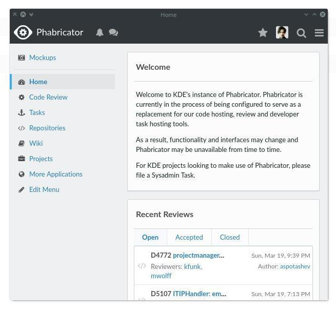
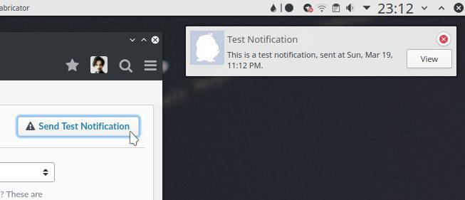
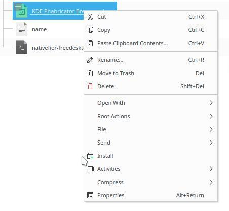
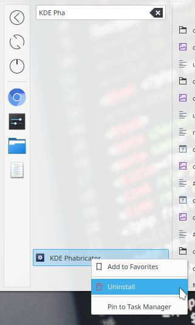
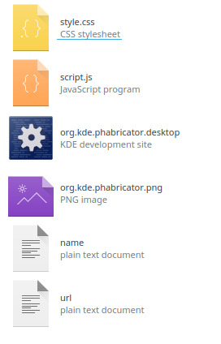

# nativefier-freedesktop
Script to automate the installation of Nativefier (Electron) web apps on Linux, following Freedesktop specifications.

Example of Web App built with this script (it's KDE Phabricator at phabricator.kde.org):



It can be launched from app menu with a themable icon, it uses custom CSS and native notifications:



## Introduction
[Nativefier](https://www.npmjs.com/package/nativefier) is a script that automatically build web apps with [Electron](https://electron.atom.io/) technology starting from URLs. It creates a folder with portable web app. The aim of nativefier-freedesktop is to install it instead, following Freedesktop specifications for Linux desktops. Also, it support injection of custom CSS stylesheets and JavaScript code, so it's useful to distribute customized versions of web apps.

### .webapp files
nativefier-freedesktop uses a custom file type as input: .webapp files. Each .webapp files contains the URL, custom CSS and JS code, .desktop launcher and the icon.

## Dependencies
* `npm` (to install Nativefier)
* `nativefier`
* `kdialog` (to show optional dialogs, if you don't want it, remove it from the script or replace it with something else)

npm is a package manager for JavaScript, you can install it from your distribution packages. Then use it to install nativefier:

```
sudo npm install nativefier -g
```

## nativefier-freedesktop from command line and installation
Assuming you have the script in your `$PATH` (i.e. in `/usr/bin`), you can use it as follow:

```
nativefier-freedesktop MyApp.webapp
```

To copy the script in your `$PATH` (specifically in `/usr/bin`) use the follow:

```
sudo cp nativefier-freedesktop /usr/bin/
```

(assuming your terminal is opened in the same folder nativefier-freedesktop is).

## "Install Web App" service menu for Dolphin
You can use "righ click > install" on .webapp files following these instruction:

1. Take install-webapp.desktop from this repo and put it in `~/.local/share/kservices5/ServiceMenus/`.
2. Open System Settings > File Associations, select "application" category and click "add" to define a new file type with "webapp" as name and "*.webapp" as filename pattern. Check that the name is correct: you should read "File type application/webapp" at the top. Push "Apply".
3. Be sure nativefier-freedesktop is in your `$PATH`.



## Uninstall a Web App
On KDE Plasma you can right-clik on the launcher of the Web App and click "Uninstall".



## How to create .webapp files
1. Download a .webapp file as example.
2. Webapp files are just .tar.gz archives renamed. So to extract them, rename adding the extension ".tar.gz".
3. Extract the .tar.gz, on Plasma: right-click > Extract > Extract Archive here.
3. You can see 6 files, edit them (see instructions below).
4. Select the 6 files (not the folder that contains them) and compress them in a .tar.gz, on Plasma: right-click > Compress > Here (as TAR.GZ).
5. Rename the .tar.gz using ".webapp" as extention.

### Specifications for .webapp files
As just said, .webapp files are .tar.gz archives with the 6 following files (no folders):



1. `name` - text file that contains only the name of the app (not displayed to the user, that is defined in .desktop launcher). Use reverse URL as convetion, i.e. org.kde.phabricator. If yours is for self-hostable apps like Nextcloud or Diaspora, use simply nextcloud and diaspora.

2. `url` - text file that contains only the URL of the app.

3. `name.desktop` - IMPORTANT: "name" is the name specified in "name" file, so i.e. `org.kde.phabricator.desktop`. It's the launcher that will be used to start the app. Edit it replacing the app name with yours in each field that contains it. Edit also "Name=", "Comment=" etc. See Freedesktop specification for more informations. It also define the action "Uninstall".

4. `name.png` - IMPORTANT: "name" is the name speficied in "name" file. It's the icon in PNG used by Nativefier and by the launcher. It can be themed by icon themes, they just have to use the same name: so i.e. if a theme contains org.kde.phabricator.svg/png that icon will be used instead of yours.

5. `style.css` - IMPORTANT: don't rename it. Edit it with the CSS you want to add to your app during the building.

6. `script.js` - same of style.css but for JavaScript code to be injected.

